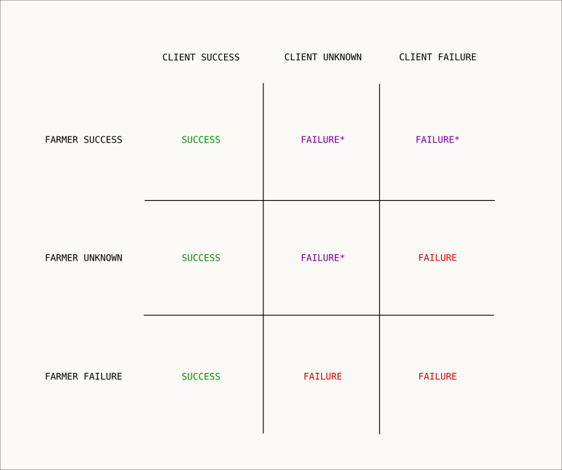

```
SIP: 9
Title: Bandwidth Reputation and Accounting
Author: Braydon Fuller <braydon@storj.io>
Status: Draft
Type: Standard
Created: 2017-09-13
```

Abstract
--------
This document details a proposal to more accurately account for bandwidth usage by a Bridge and to ensure that shards can be successfully transferred between Client and Farmer by building reputation metric based on successful transfers.

Motivation
----------
- A Bridge is currently unable to track if a shard transfer was successful and only that a request was made.
- Response time is currently used as a metric to prioritize which Farmers to store data. However there are issues with this because it doesn't account if shards have actually been transferred, only that it was possible to make a request. Successful transfer of shards between Client and Farmer should be considered.
- Clients can have too much bandwidth accounted as some of the shard transfers will have not been successful, each request is currently logged without consideration of failure.
- Farmer bandwidth related payouts can be incorrectly accounted. *Exchange Reports* can currently be used as confirmation from the Client, however missing reports are not considered. Sending payment without actual success could lead to misaligned incentives and decline of quality.

Specification
-------------

There are three perspectives for each shard transfer; the Client, Bridge and Farmer.
- A Bridge will record a *Storage Event* each time that a shard upload or download is requested.
- The Client will then send an *Exchange Report* on the SUCCESS or FAILURE of that transfer. Each report MUST match with a corresponding *Storage Event*, otherwise it should be ignored.
- A report from the Farmer can help confirm failure on the Client. However accurate reporting shouldn't be expected. As we can see by taking a look at the possible combinations and how the discrepancies can be resolved, and that the most relevant data is from the Client:



A Client report of a FAILURE or otherwise UNKNOWN will be handled with special consideration for the purpose to encourage it's only used when there is actual FAILURE.
- There will be a limited percentage of unconfirmed FAILURE reports to total reports that can be made — there should only be a small part of the network that isn't cooperating.
- A SUCCESS report will positively effect the reputation of the corresponding Farmer, and likewise a FAILURE report will have a negative effect. The amount of reputation points can be based on the number of bytes of the transfer. Thus accurate reporting is encouraged to improve quality at the interest of the Client. These metrics can be used in combination with [SIP6](sip-0006.md) for selecting which Farmers to upload data to further encourge successful shard transfers.
- If unconfirmed FAILURE reports, or lack of reports, exceed a tolerable expected threshold of unconfirmed FAILURE per Client reporter, the Client account is flagged as having unexpected rates of FAILURE. The behavior of such a flag can be configurable. It could be handled so that any repeated unconfirmed FAILURE reports or UNKNOWN would be considered SUCCESS reports as to prevent abuse. For example in the scenario where a Client isn't reporting SUCCESS or FAILURE, it would be assumed to always have SUCCESS status. By reporting not only would it improve the quality, but it would also more accurately track bandwidth usage by accounting for failures.

### Storage Event

A storage event MUST be created anytime that there is a request to upload or download a shard. The event will include the Client and Farmer pair and the hash of the shard.

```
{
  "id": "<storage-event-id>",
  "dataHash": "<shard-hash>",
  "farmerId": "<farmer-id>",
  "clientId": "<node-id>",
  "timestamp": <unix-timestamp-milliseconds>,
  "downloadBandwidth": <bytes-of-the-shard-for-download>,
  "storage": <bytes-of-the-shard-for-upload>,
  "success": <boolean>
}
```

The "downloadBandwidth" will be included for all download requests, and "storage" will be included for upload requests. The "status" is a boolean to indicate the success of the transfer. The status can be set based on the specification detailed earlier, and updated when exchange reports are sent for this storage event.

### Exchange Report

Each upload and download of a shard MUST be associated with a *Storage Event* id, this id can then be referenced when sending an exchange report from the Client and Farmer.

```
{
  "id": <storage-event-id>,
  "exchangeResultCode": <1000|1100>,
  "exchangeResultMessage": <message>,
  "exchangeStart": <unix-timestamp-milliseconds>,
  "exchangeEnd": <unix-timestamp-milliseconds>
}
```

Result Codes:
- Success: 1000
- Failure: 1100

Result Messages:
- Failed integrity: "FAILED_INTEGRITY"
- Shard downloaded: "SHARD_DOWNLOADED"
- Shard uploaded: "SHARD_UPLOADED"
- Download error: "DOWNLOAD_ERROR"
- Upload error: "TRANSFER_FAILED"

A report from a Farmer MUST be signed to authenticate it, the signature should follow the same method as defined in [SIP6](https://github.com/Storj/sips/blob/master/sip-0006.md#farmer-contact-discovery). A report from a Client MUST also be authenticated, this can be done with HTTP Basic Authentication.

### Reputation

A periodic script can query *Storage Events* between two points in time and apply those results to a bandwidth reputation metric on a contact. This could be based on a rolling window or estimated moving average as similar to `timeoutRate` and `responseTime` currently on a contact.

Reference Implementation
------------------------

TODO

Copyright
-------------

This work is licensed under a [Creative Commons Attribution-ShareAlike 4.0 International License](http://creativecommons.org/licenses/by-sa/4.0/).